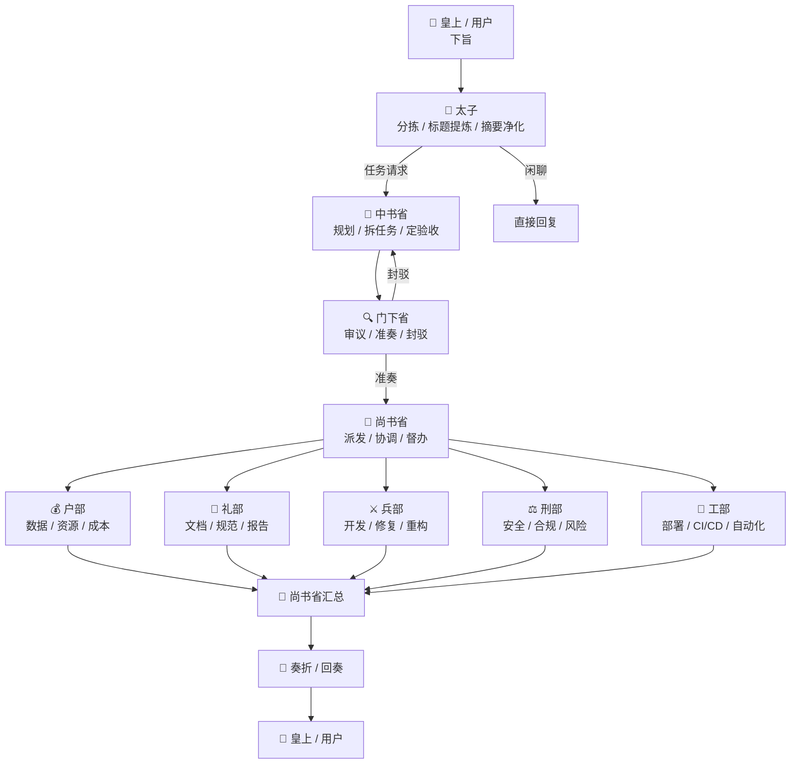

# ⚔️ Edict Fork V2

> 把 **三省六部多 Agent 协作** 从一个很酷的 Demo，做成一套真正能长期演进的工程化系统。

这是我基于原始 **Edict / 三省六部** 项目做的 V2 fork。

我不想丢掉原项目最有价值的部分——**“用三省六部来组织多 Agent” 这个极强的具象化设计**。相反，V2 要做的事情是：

- 保留这套 **皇上 → 太子 → 中书 → 门下 → 尚书 → 六部 → 回奏** 的制度化流转
- 把每一步都做成 **明确的状态、事件、职责和审计记录**
- 让它不只是“能演示”，而是能继续开发、测试、追踪、回放和扩展

一句话说：

> **V1 是“AI 上朝”的精彩展示；V2 是把这套朝廷体制真正做成系统。**

---

## 这项目到底在做什么？

可以把 Edict 理解成一个“朝廷化”的多 Agent 操作系统。

当你给系统下一个旨意，比如：

> 给我做一个用户注册系统，要有 FastAPI、PostgreSQL、JWT、测试和部署文档。

它不是扔给一个万能 Agent 自己想办法，而是按朝廷制度流转：

```text
你（皇上）
  ↓ 下旨
太子
  ↓ 分拣 / 提炼需求
中书省
  ↓ 规划 / 拆任务
门下省
  ↓ 审议 / 准奏 or 封驳
尚书省
  ↓ 派发 / 协调
六部
  ↓ 分头执行
尚书省
  ↓ 汇总回奏
你（皇上）
```

这个设计的重点不是“古风好玩”，而是：

- **先分拣**：不是所有消息都值得建任务
- **先规划**：先把任务拆明白，不直接瞎干
- **先审议**：防止烂方案直接进入执行层
- **再派发**：不同专业部门做不同的事
- **再汇总**：最终回给用户的是完整奏折，不是碎片聊天记录

这就是三省六部作为多 Agent 架构的价值。

---

## 🏛️ 三省六部 V2 总览图

```text
┌──────────────────────────────────────────────────────────────┐
│                        👑 皇上 / 用户                        │
│              下旨、追问、叫停、准奏、查看回奏                │
└─────────────────────────────┬────────────────────────────────┘
                              │
                              ▼
┌──────────────────────────────────────────────────────────────┐
│                      🐣 太子 / taizi                         │
│   分拣入口消息：闲聊直接回；任务提炼标题、摘要、优先级        │
└─────────────────────────────┬────────────────────────────────┘
                              │  task.created / task.routed.taizi
                              ▼
┌──────────────────────────────────────────────────────────────┐
│                    📜 中书省 / zhongshu                      │
│      规划任务：拆目标、列子任务、定依赖、定验收标准          │
└─────────────────────────────┬────────────────────────────────┘
                              │  task.planning.complete
                              ▼
┌──────────────────────────────────────────────────────────────┐
│                     🔍 门下省 / menxia                       │
│      审议方案：准奏 / 封驳 / 附条件通过，拦截坏方案           │
└─────────────────────────────┬────────────────────────────────┘
                              │  task.review.approved
                              ▼
┌──────────────────────────────────────────────────────────────┐
│                    📮 尚书省 / shangshu                      │
│          派发执行：督办、协调、催办、汇总、最后回奏          │
└──────────────┬──────────────┬──────────────┬─────────────────┘
               │              │              │
               ▼              ▼              ▼
      ┌─────────────┐ ┌─────────────┐ ┌─────────────┐
      │ 💰 户部      │ │ 📝 礼部      │ │ ⚔️ 兵部      │
      │ 数据/资源    │ │ 文档/规范    │ │ 代码/实现    │
      └─────────────┘ └─────────────┘ └─────────────┘

      ┌─────────────┐ ┌─────────────┐ ┌─────────────┐
      │ ⚖️ 刑部      │ │ 🔧 工部      │ │ 📋 吏部      │
      │ 风险/合规    │ │ 部署/基建    │ │ Agent治理    │
      └─────────────┘ └─────────────┘ └─────────────┘

                    ┌─────────────────────────────┐
                    │ 🌅 早朝官 / zaochao          │
                    │ 晨报、情报、日报、外部信息   │
                    └─────────────────────────────┘

        所有过程沉淀为：事件流 / 状态机 / Todo / Thought / 奏折
```

这张图对应的不是一张“概念海报”，而是 V2 想真正落地的系统结构：

- **太子** 管入口
- **中书省** 管规划
- **门下省** 管审议
- **尚书省** 管执行编排
- **六部** 管专业产出
- **吏部** 管 Agent 编制与权限
- **早朝官** 管信息补给与定时报送

---

## 🔄 一条旨意如何流转



如果把它翻译成系统行为，就是：

1. **太子先判断是不是任务**
2. **中书省给出任务规划单**
3. **门下省决定是否准奏**
4. **尚书省把任务拆派给相关部门**
5. **六部并行执行**
6. **尚书省统一收口，形成回奏**

这也是 V2 为什么强调 **状态机 + 事件流 + 控制面**：

因为这条链路里，每一个节点都应该是可见、可追踪、可干预的。

---

## 为什么要做 V2？

原版 Edict 已经证明了一件事：

> **三省六部这个多 Agent 组织模型是成立的。**

它已经很强了：

- 有强角色感
- 有看板
- 有任务流转
- 有奏折归档
- 有模板、技能、模型配置
- 用户一眼就能看懂“谁在干什么”

但如果想继续往下做，就会遇到几个问题：

### 1. 现在更像“能跑的原型”，还不是稳定内核
很多能力已经有了，但流程、状态、数据和展示之间还不够彻底解耦。

### 2. 很多东西能看到，但还不够好追踪
比如你能知道任务在流转，但未必能很清楚地回答：

- 这个任务为什么被门下省打回？
- 是谁把状态从 A 改成 B？
- 某个执行步骤失败时，系统该如何恢复？
- 前端看到的状态和后台真实状态是否一致？

### 3. 要继续扩展，必须把“制度”落成“系统”
三省六部在概念上是清楚的，但 V2 要把它继续具象化成：

- 明确的任务状态机
- 明确的事件协议
- 明确的每个部门输入/输出
- 明确的控制面
- 明确的审计与回放能力

所以 V2 不是单纯“重写一下技术栈”，而是：

> **把朝廷制度从叙事，变成程序。**

---

## 🆚 V1 和 V2 到底差在哪？

这次 V2 我不只是在 README 里换一种说法，而是把前面提出的那些改进点，正式收敛成 V2 的设计目标。

### 核心差异图

| 维度 | V1 | V2 |
|---|---|---|
| **流程模型** | 默认几乎都走完整朝廷流程 | **三档流程**：轻办 / 常规 / 重审 |
| **太子职责** | 分拣消息、转交任务 | 分拣 + 风险初判 + 建议流转路径 |
| **中书省职责** | 规划、拆解 | **只负责目标澄清 / 任务树 / 验收标准 / 风险说明** |
| **尚书省职责** | 派发、协调、汇总 | **只负责按任务树派发、追踪、催办、汇总，不改业务目标** |
| **门下省模式** | 更像统一审核关口 | **规则门禁 + 审议官双模式**，只在高风险/高成本/冲突场景进入深审 |
| **权限模型** | 以通信矩阵为主 | **动作级权限模型**：谁能审、谁能派、谁能部署、谁能发外部消息 |
| **六部协作** | 专业分工，但重叠边界较模糊 | **主责部门 + 协同部门 + 会签机制** |
| **测试/验收** | 常压在兵部或门下 | **新增独立验收角色：试院 / 质检司** |
| **知识沉淀** | 以文档/历史记录为主 | **新增翰林院 / 档案中枢**：模板、案例、规范、复盘沉淀 |
| **异常处理** | 依赖人工兜底 | **异常流 / 退回流 / 超时接管 / 冲突处理** 写入状态机 |
| **任务成本控制** | 主要靠人工节制 | **尚书省任务预算**：Agent 数、轮次、token、耗时、外部调用 |
| **用户视角** | 容易看到很多内部细节 | **外部简化视图**：只看“理解了什么 / 怎么做 / 进展到哪” |

### 一句话总结

- **V1**：制度感很强，已经能看见三省六部协作
- **V2**：把制度进一步做成“可运行的规则系统”，避免过慢、过重、过于依赖人工理解

---

## ✅ V2 已吸收的关键改进点

这部分就是把前面那套分析，明确落到 V2 的设计里。

### 1. 三档流程：不是所有事都上朝廷全流程
V2 明确引入三档流转模式，解决“流程太重、简单任务被复杂化”的问题。

#### 轻办模式
适合：
- 闲聊
- 简单查询
- 单步文案
- 低风险轻任务

流转：

```text
太子 → 直接回复 / 直派专业部门
```

例子：
- 问天气
- 润色一段文案
- 查一个 API 参数
- 输出一段普通说明文字

#### 常规模式
适合：
- 中等复杂度任务
- 需要规划，但不一定高风险

流转：

```text
太子 → 中书 → 尚书 → 六部 → 尚书汇总
```

门下省只在规则触发或抽检时介入。

#### 重审模式
适合：
- 改代码
- 上线部署
- 对外发送
- 涉及安全 / 合规 / 权限
- 跨部门复杂任务

流转：

```text
太子 → 中书 → 门下 → 尚书 → 六部 → 门下复核（可选）→ 尚书回奏
```

这也是 V2 和 V1 的第一层本质区别：

> **V2 不追求“所有任务都走得像上朝”，而追求“该重就重，该轻就轻”。**

---

### 2. 输入 / 输出契约：每个角色说什么、交什么，不再模糊
V2 把几个关键角色的输出格式明确化，减少语义漂移。

#### 太子输出契约
- 任务类型（闲聊 / 查询 / 执行任务）
- 用户意图摘要
- 优先级
- 风险等级
- 建议流转模式（轻办 / 常规 / 重审）

#### 中书省输出契约
- 目标定义
- 成功标准
- 子任务列表
- 依赖关系
- 所需部门
- 风险点
- 是否需要门下审议

#### 门下省输出契约
- 审议结论（准奏 / 退回 / 附条件准奏）
- 风险说明
- 必改项
- 审议依据

#### 尚书省输出契约
- 派发单
- 子任务状态
- 阻塞项
- 汇总结论
- 回奏摘要

这部分是 V2 的核心治理能力之一：

> **组织图只是名字；输入输出契约才是系统。**

---

### 3. 动作级权限：不只是“能和谁说话”，而是“能做什么”
V1 已经有通信矩阵，这是很好的基础；V2 在此之上增加动作级权限。

#### 示例动作权限
- `create_task`
- `classify_task`
- `decompose_task`
- `approve_task`
- `reject_task`
- `dispatch_task`
- `execute_code`
- `run_shell`
- `deploy_prod`
- `send_external_message`
- `modify_config`
- `close_task`

#### 示例理解
- 太子可以 `classify_task`，但不能 `deploy_prod`
- 中书省可以 `decompose_task`，但不能直接 `dispatch_task`
- 门下省可以 `approve_task` / `reject_task`，但不负责执行
- 尚书省可以 `dispatch_task` / `close_task`，但不能篡改任务目标
- 工部可能具备 `run_shell`，但 `deploy_prod` 需要更高权限或门下审批

这会让 V2 从“分角色”升级到“分角色 + 分动作 + 分风险”。

---

### 4. 门下省双模式：规则门禁 + 审议官
这是 V2 减少瓶颈的关键设计。

V1 最大的问题之一是：

> 如果门下省什么都审，那它就是整个系统的堵点。

所以 V2 把门下省设计成两层：

#### 第一层：规则门禁
自动识别：
- 是否涉及生产环境
- 是否涉及外部发送
- 是否涉及权限、密钥、财务、安全
- 是否跨部门高成本
- 是否超过预算阈值

#### 第二层：审议 Agent
只在这些场景深度介入：
- 高风险
- 高成本
- 模糊任务
- 规则冲突
- 需要例外批准

这样门下省不再是“逢单必审”，而是：

> **先让规则挡住明显高风险，再让审议官处理真正需要判断的部分。**

---

### 5. 六部协作规则：主责 + 协同 + 会签
V2 认为“六部分工”不能只停在概念层，必须能处理重叠任务。

例如：
- 写部署规范：礼部 or 工部？
- 安全扫描并出整改文档：刑部 + 礼部？
- 排查线上性能：兵部 + 户部 + 工部？

V2 的处理方式是：

- 每类任务定义 **主责部门**
- 需要时定义 **协同部门**
- 高风险或交付型任务允许 **会签**
- 最终由主责部门或尚书省统一提交结果

这可以让系统从“靠尚书省临场协调”升级到“有明确协作规则”。

---

### 6. 补上知识中枢：翰林院 / 档案司
V2 明确把“组织记忆”作为系统组成部分，而不是默认它自然存在。

新增建议角色：
- **翰林院** / **档案司** / **秘阁**

负责：
- 历史任务模板
- 标准作业流程
- 决策记录
- 复盘案例
- FAQ / 规范基线
- 给中书省提供历史参考
- 给门下省提供审议依据
- 给六部提供执行参考

这会让 V2 不只是“跑任务”，而是：

> **能从历史里积累组织智慧。**

---

### 7. 补上独立测试 / 验收角色：试院 / 质检司
V2 不希望“兵部自己写、自己测、自己说没问题”。

所以会新增独立角色，例如：
- **试院**
- **质检司**
- **都察院（偏审计）**

职责：
- 测试计划
- 用例执行
- 回归验证
- 验收签收
- 结果评分

这样能把“开发”和“验证”分开，降低执行层自我确认的偏差。

---

### 8. 异常流 / 退回流：让系统处理坏情况，不只处理好情况
V2 会把异常态写进状态机，不再只描述正常流程。

#### 关键状态示例
- 已接旨
- 待澄清
- 已规划
- 待审议
- 审议退回
- 待派发
- 执行中
- 部分完成
- 待汇总
- 待复核
- 已回奏
- 已归档
- 已中止

#### 关键异常问题
- 某部门超时怎么办？
- 某子任务失败怎么办？
- 多部门结论冲突怎么办？
- 门下封驳后谁负责改？
- 用户中途追加需求怎么办？

V2 的目标就是把这些事情都显式化，而不是靠聊天补流程。

---

### 9. 尚书省任务预算：防止任务无限膨胀
V2 给尚书省增加预算概念，用于控制复杂任务的成本。

#### 预算维度
- 最大 Agent 数
- 最大轮次
- 最大 token
- 最大耗时
- 最大外部调用次数

这让尚书省不只是“任务分发器”，而是带成本意识的调度官。

---

### 10. 外部界面简化：内部复杂，外部简单
V2 会区分：

- **内部治理视图**：给系统管理员 / 高级用户看完整流转
- **用户简化视图**：只展示三件事
  - 我理解你的需求是什么
  - 我准备怎么处理
  - 现在进展到哪一步了

这样用户不会被全套中书、门下、尚书、六部细节淹没。

---

## 🧭 V2 的升级后总体组织图

```text
┌─────────────────────────────────────────────────────────────────────────┐
│                               👑 皇上 / 用户                           │
└──────────────────────────────────┬──────────────────────────────────────┘
                                   │
                         轻办 / 常规 / 重审 三档流程
                                   │
                                   ▼
┌─────────────────────────────────────────────────────────────────────────┐
│  🐣 太子：分拣、净化、定优先级、判风险、建议流转模式                    │
└──────────────────────────────────┬──────────────────────────────────────┘
                                   ▼
┌─────────────────────────────────────────────────────────────────────────┐
│  📜 中书省：目标澄清、任务树、依赖关系、验收标准、风险说明               │
└──────────────────────────────────┬──────────────────────────────────────┘
                                   ▼
┌─────────────────────────────────────────────────────────────────────────┐
│  🔍 门下省：规则门禁 + 审议官双层审查                                   │
│      仅对高风险 / 高成本 / 冲突任务深审                                 │
└──────────────────────────────────┬──────────────────────────────────────┘
                                   ▼
┌─────────────────────────────────────────────────────────────────────────┐
│  📮 尚书省：按任务树派发、追踪、预算控制、异常接管、汇总回奏             │
└──────────────┬──────────────┬──────────────┬──────────────┬────────────┘
               ▼              ▼              ▼              ▼
        💰 户部主责      📝 礼部主责      ⚔️ 兵部主责      ⚖️ 刑部主责
         数据/成本         文档/规范         工程实现         风险/审计

               ▼              ▼              ▼              ▼
        🔧 工部协同      📋 吏部治理      🏛️ 翰林院沉淀     🧪 试院验收
         基建/部署        权限/编制         知识/模板         测试/回归

                所有过程进入：事件流 / 状态机 / 奏折 / 回放 / 审计
```

---

## 三省六部在 V2 里分别负责什么？

这是 V2 最重要的部分：**角色不只是名字，要有清晰职责。**

### 👑 皇上（用户）
你只做三件事：

- 下旨
- 查看进展
- 准奏 / 叫停 / 追问 / 改需求

你不需要直接协调六部，也不需要自己盯底层执行。

---

### 🐣 太子（taizi）—— 入口分拣官
太子不是干活的，它负责“先判这是不是一份旨意”。

它主要做：

- 区分 **闲聊** 和 **任务型请求**
- 给任务取一个干净、明确的标题
- 提炼出任务摘要
- 过滤脏输入、元数据、路径、聊天废话
- 决定这条消息是否进入正式流程

例如：

用户说：

> 我这边有个 Android 项目，登录页太乱了，帮我整理一下思路，顺便看看是不是要拆成几个模块。

太子做完后，交给中书省的可能是：

- **任务标题**：重构 Android 登录页并梳理模块边界
- **任务摘要**：分析现有登录页结构，给出模块拆分建议，必要时形成可执行子任务
- **来源**：用户直接下旨
- **优先级**：中

太子的价值就是：

> **不让原始聊天噪音直接污染整个任务系统。**

---

### 📜 中书省（zhongshu）—— 规划与拆解中枢
中书省不直接编码，不直接部署，它负责“把旨意变成计划”。

它主要做：

- 理解用户真正要什么
- 明确产出物是什么
- 拆成子任务
- 指定哪些任务该给哪些部门
- 给出执行顺序、依赖关系、验收标准

例如收到“做用户注册系统”后，中书省会拆成：

1. **兵部**：设计并实现注册 API、JWT 鉴权逻辑
2. **户部**：梳理数据表结构、字段约束、数据字典
3. **礼部**：编写 API 文档与部署文档
4. **工部**：补 Docker / CI / 部署配置
5. **刑部**：检查密码存储、鉴权流程和安全风险

中书省的产物不应该是一堆空话，而应该是一张很清楚的“任务派工单”。

它回答的是：

> **这件事怎么做，拆成什么，交给谁做，做到什么算完成。**

---

### 🔍 门下省（menxia）—— 审议与封驳机关
门下省是这套系统的质量关。

它不是来执行任务的，而是专门负责：

- 审中书省的方案是否合理
- 看任务拆解是否遗漏风险
- 判断是否需要返工重规划
- 对不合格方案进行封驳
- 对高风险任务提出附加条件

比如中书省给出一个方案：

- 直接上 JWT
- 不做 refresh token
- 部署文档后补
- 测试暂不写

门下省可能会打回：

- 测试缺失，不能直接准奏
- 安全设计不完整
- 文档不能后补，应并行纳入交付范围
- 需补充失败场景和异常返回设计

所以门下省不是摆设，它是：

> **防止“会做事的 Agent”把系统越做越乱的制度刹车。**

---

### 📮 尚书省（shangshu）—— 派发、督办、汇总
尚书省是执行层总调度。

它不负责重新规划，也不负责专业细节实现。它负责：

- 接收准奏后的任务
- 按中书省方案派发给各部
- 跟踪执行状态
- 处理阻塞、超时、卡住的子任务
- 汇总各部结果
- 最终整理回奏

比如一个任务需要兵部、礼部、工部协同：

- 兵部还在写接口
- 礼部已经开始写 API 文档
- 工部发现缺少环境变量清单

尚书省要做的不是自己去写代码，而是：

- 让兵部补齐接口定义
- 让礼部基于最新接口草拟文档
- 让工部补环境配置模板
- 最后把三份结果合并成一份可交付的奏折

尚书省的核心价值是：

> **执行不是放出去就不管，而是要有人持续调度、追踪和收口。**

---

## 六部在 V2 里怎么分工？

### 💰 户部（hubu）—— 数据与资源
户部负责偏数据、资源、核算一侧的任务。

典型职责：

- 数据整理
- 表结构建议
- 报表生成
- 成本分析
- 数据质量检查
- 指标口径整理

适合的任务例子：

- 分析最近 30 天活跃用户数据
- 设计注册表字段与约束
- 做一份运营数据报表
- 估算某流程的模型调用成本

---

### 📝 礼部（libu）—— 文档、规范、表达
礼部负责把系统性的知识沉淀成可读、可交付的文档。

典型职责：

- API 文档
- 接口说明
- 部署文档
- 规范文档
- 汇报材料
- PRD / 说明书 / 周报等文字型产物

适合的任务例子：

- 给注册系统补 API 文档
- 为项目编写接入说明
- 输出一份改造方案汇报
- 统一错误码文档

---

### ⚔️ 兵部（bingbu）—— 工程实现
兵部是最典型的“干活部门”，负责真正的代码和功能落地。

典型职责：

- 新功能开发
- Bug 修复
- 重构
- 算法实现
- 代码审查
- 工程问题排查

适合的任务例子：

- 实现注册 / 登录接口
- 修复某个前端状态 bug
- 改造 Android 登录页结构
- 给老模块补测试

---

### ⚖️ 刑部（xingbu）—— 风险、合规、安全
刑部负责“这东西能不能放心上线”。

典型职责：

- 安全审计
- 合规检查
- 敏感操作审查
- 风险识别
- 权限边界检查

适合的任务例子：

- 检查密码是否明文存储
- 审核登录流程是否有越权漏洞
- 看接口是否暴露敏感数据
- 审查部署流程里是否写死密钥

---

### 🔧 工部（gongbu）—— 基建、部署、自动化
工部负责让代码真正“能跑起来、能发出去、能持续运转”。

典型职责：

- Docker / Compose
- CI/CD
- 环境配置
- 自动化脚本
- 部署方案
- 工具链建设

适合的任务例子：

- 给项目补 docker-compose
- 配 GitHub Actions
- 写初始化脚本
- 规范环境变量与部署流程

---

### 📋 吏部（libu_hr）—— Agent 编制与治理
吏部不直接参与业务执行，它更像组织治理中枢。

典型职责：

- Agent 注册与编制管理
- 权限矩阵维护
- 模型配置管理
- 技能安装与分配
- 组织规则维护
- 后续的绩效体系

它回答的问题是：

- 这个 Agent 该不该存在？
- 它能做什么？
- 它能给谁发消息？
- 它应该使用什么模型和技能？

---

### 🌅 早朝官（zaochao）—— 情报与日报
早朝官更像一个情报和汇报角色。

典型职责：

- 定时汇总新闻或外部信息
- 生成晨报 / 日报
- 做“今日朝会摘要”
- 给上层提供决策背景材料

它不负责主线任务闭环，但适合做信息补给与汇报入口。

---

## 一条任务在 V2 里会怎么流转？

这是 README 最想讲清楚的部分。

### 例子：做一个“用户注册系统”

用户下旨：

> 给我设计并实现一个用户注册系统，要有 FastAPI、PostgreSQL、JWT、测试和部署文档。

### 第 1 步：太子分拣
太子判断：这是任务，不是闲聊。

产出：

- 标题：实现用户注册系统（FastAPI + PostgreSQL + JWT）
- 摘要：包含后端实现、测试、部署文档
- 优先级：中高
- 建议进入正式流转

系统事件可以具象为：

- `task.created`
- `task.routed.taizi`

---

### 第 2 步：中书省规划
中书省输出规划单：

- 兵部：实现注册接口、鉴权逻辑、测试
- 户部：设计表结构、字段约束
- 礼部：编写 API 文档、部署说明
- 工部：准备 Docker / 部署配置
- 刑部：检查安全设计

系统事件可以具象为：

- `task.planning.request`
- `task.planning.complete`

同时会产出结构化 `todos`。

---

### 第 3 步：门下省审议
门下省检查规划单：

- 是否漏了测试？
- 是否漏了异常返回？
- JWT 是否有刷新机制？
- 部署文档是不是被放到了“以后再说”？

如果不通过：

- `task.review.rejected`
- 退回中书省重规划

如果通过：

- `task.review.approved`
- 准奏进入派发阶段

---

### 第 4 步：尚书省派发
尚书省根据审议后的规划，把任务正式拆派给相关部门。

此时系统要能看到：

- 哪些子任务已派发
- 哪个部门正在执行
- 是否有阻塞
- 是否有超时
- 当前整体完成度

系统事件可以具象为：

- `task.dispatch.request`
- `task.dispatch.sent`
- `task.status.executing`

---

### 第 5 步：六部执行
各部按职责输出结果：

- 兵部提交代码与测试
- 户部补数据模型说明
- 礼部补文档
- 工部补部署文件
- 刑部给出审计意见

系统会持续收到：

- `agent.thought.append`
- `agent.todo.update`
- `task.progress.append`

这时前端不只是看“完成/未完成”，而是能真正看到：

- 现在是谁在做
- 做到了哪一步
- 卡在哪
- 刚刚发生了什么

---

### 第 6 步：尚书省汇总回奏
所有执行结果返回后，尚书省统一汇总：

- 本次交付包含什么
- 哪些部分已完成
- 哪些部分待补
- 有哪些风险或注意事项
- 最终回奏内容是什么

最终形成：

- 一个完成态任务
- 一条完整流转链
- 一份可复盘、可审计的“奏折”

---

## V2 不是更抽象，而是更具象

表面上看，V2 引入了这些听起来比较“工程”的词：

- Event Bus
- WebSocket
- Task State Machine
- Control Plane
- Audit / Replay

但它们在这个项目里不是为了抽象而抽象，而是为了把三省六部的每一步都做得更具体。

比如：

### 以前你只能说“门下省在审核”
V2 希望做到：

- 门下省收到什么输入
- 它审了哪些条目
- 为什么打回
- 它是在哪个时间点做出的决定
- 决定之后系统如何变更状态

### 以前你只能说“尚书省在协调”
V2 希望做到：

- 尚书省发给了哪些部门
- 哪个子任务阻塞了
- 谁超时了
- 是否触发重试或人工介入
- 汇总时用了哪些结果

也就是说：

> **V2 的工程化，不是在削弱三省六部的具象，而是在把这种具象真正落成可执行的系统结构。**

---

## 当前仓库结构

这个仓库目前分成两层：

### 1. 原版 / Legacy（V1 资产）
保留原项目已有内容，方便参考和兼容：

- `agents/` — 原版省部 SOUL 配置
- `dashboard/` — 原版看板与服务
- `scripts/` — 原版同步、采集、技能、模型切换脚本
- `docs/` — 截图、演示、旧架构说明
- `tests/` — 原版测试

### 2. V2 新架构
这是当前 fork 的重点：

```text
edict/
├─ backend/                # FastAPI 后端 / API / 状态机 / 服务层 / 事件流
├─ frontend/               # React 18 控制台
├─ migration/              # 数据迁移脚本
├─ scripts/                # V2 辅助脚本
├─ docker-compose.yml      # 本地联调
└─ .env.example
```

如果你想先看 V2 核心，建议从这些文件开始：

- `edict/backend/app/main.py`
- `edict/backend/app/services/task_service.py`
- `edict/backend/app/services/event_bus.py`
- `edict/backend/app/models/`
- `edict/frontend/src/`
- `edict_agent_architecture.md`

---

## 当前 V2 已经有什么？

### 已有基础
- [x] FastAPI 后端骨架
- [x] API 路由分层（tasks / agents / events / admin / websocket）
- [x] 基础任务模型与状态机
- [x] 任务服务层（create / transition / dispatch / progress / todos）
- [x] React 18 + TypeScript 前端工程目录
- [x] Docker / migration 基础文件
- [x] 架构草图文档

### 正在补齐
- [ ] 统一事件协议
- [ ] worker / orchestrator 闭环
- [ ] planning → review → dispatch → execute 全链路
- [ ] WebSocket 实时订阅完善
- [ ] thought / todo / event 的统一前端展示
- [ ] legacy 数据迁移

### 下一步重点
- [ ] 门下省审议产品化
- [ ] 尚书省调度面板
- [ ] 任务回放 / 奏折时间线
- [ ] 人工叫停 / 恢复 / 重试 / 封驳
- [ ] 吏部权限与 Agent 治理能力
- [ ] 国史馆 / 知识沉淀

---

## V1 和 V2 的关系

我不是想把原项目推翻重来。

我更想做的是：

### V1 负责证明：这套制度是对的
- 三省六部的组织比“几个 Agent 自由聊天”更清楚
- 门下省这种审核制很有价值
- 看板、奏折、模板等表达层是很有感染力的

### V2 负责证明：这套制度可以被工程化
- 每个环节都能变成稳定状态机
- 每次流转都能变成结构化事件
- 每个部门都能有清晰输入输出
- 用户能在控制台里真正介入这套系统

所以两者关系可以概括成：

- **V1：制度概念的产品表达**
- **V2：制度概念的系统落地**

---

## 推荐开发顺序

如果你也认同这个方向，我觉得 V2 最合理的推进顺序是：

### Phase 1：先跑通最小主线
- 创建任务
- 状态流转
- 事件发布
- WebSocket 推送
- 前端能看见主流程

### Phase 2：把三省做实
- 太子分拣输入
- 中书省输出规划单
- 门下省输出审议结果
- 尚书省执行派发与收口

### Phase 3：把六部执行做实
- 子任务分派
- 进度采集
- 超时与阻塞处理
- 汇总回奏

### Phase 4：把控制面做强
- Timeline
- Replay
- Pause / Resume / Retry
- 人工审批
- 性能与健康监控

---

## 快速开始

> 注意：V2 目前还是基础建设阶段，下面更适合开发者本地阅读与联调，不等于正式发布版安装说明。

### 克隆仓库

```bash
git clone https://github.com/susyimes/edictForkV2.git
cd edictForkV2
```

### 查看 V2 目录

```bash
cd edict
```

建议优先阅读：

- `backend/app/main.py`
- `backend/app/services/task_service.py`
- `backend/app/services/event_bus.py`
- `frontend/src/App.tsx`
- `../edict_agent_architecture.md`

当前仓库已经具备：

- `edict/backend/requirements.txt`
- `edict/frontend/package.json`
- `edict/docker-compose.yml`

后续会继续补齐更正式的启动与开发说明。

---

## 文档

- `edict_agent_architecture.md` — V2 架构草图与设计思路
- `docs/task-dispatch-architecture.md` — V1 / 原版任务流转说明
- `ROADMAP.md` — 路线图

---

## 这个 fork 当前的定位

这个仓库不是“已经做完的三省六部平台”，而是：

> **一个正在把三省六部多 Agent 制度，正式做成可运行、可观察、可治理系统的 V2 分支。**

如果你对这些方向感兴趣，它会值得继续做：

- Multi-Agent Orchestration
- Event-Driven Systems
- Agent Observability
- Human-in-the-loop Workflow
- Task Audit / Replay
- 用制度设计 AI 协作系统

---

## License

沿用原项目 License，详见 `LICENSE`。
